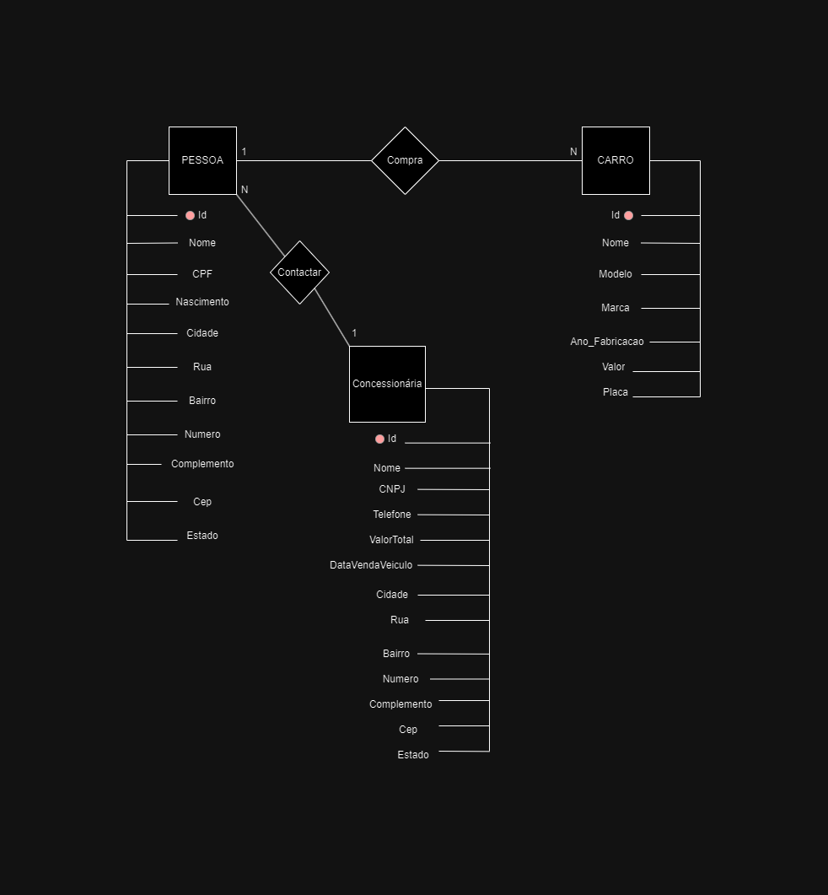
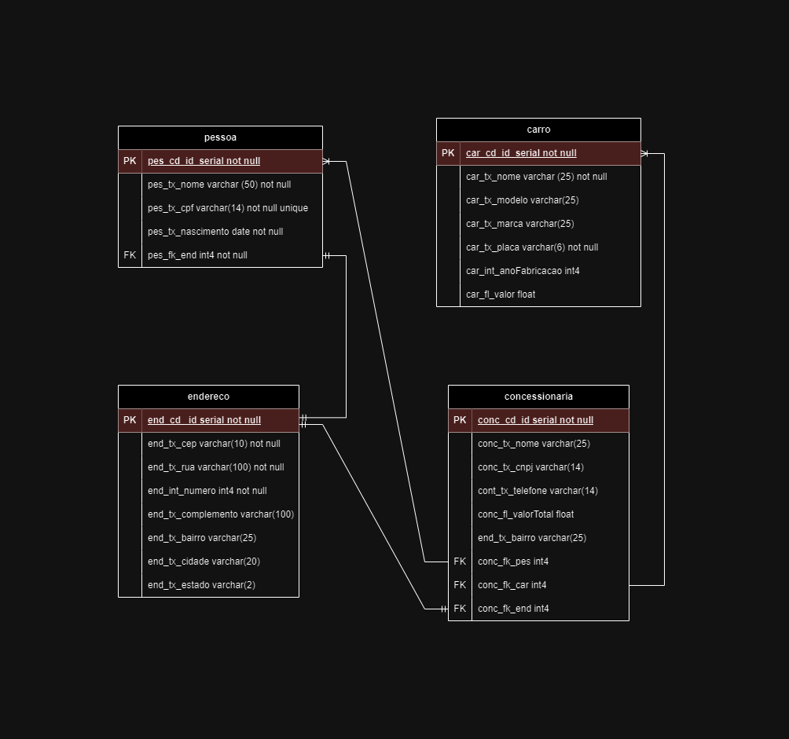

<h1 align="center">
    
</h1>

## :detective:Índice

<ul>
    <li>Sobre o Projeto</li>
    <li>Tecnologias utilizadas</li>
    <li>Diagrama</li>
    <li>Autores do Projeto</li>
</ul>

## :desktop_computer:Sobre o Projeto

Um banco de dados que representa uma concessionária que tem varios carros e varios clientes, o cliente contacta  com  a concessionária solicitando um carro específico a concessionária vai verificar se tem disponibilidade do carro e se tiver ela efetuará a venda para o cliente.

O banco tem as tabelas: pessoa, endereço, concessionaria  e carro.

Contexto - Uma pessoa contacta uma concessionaria em busca de encontrar o seu veículo dos sonhos, a concessionária por sua vez tem alguns modelos de carros e faz o intermédio oferencendo os carros e fazendo as vendas. a concessionaria tem acesso aos dados  do  cliente para assim finalizar toda a documentação de venda do veículo.

Regras:

- O Cliente só pode ter um cpf
- A concessionaria só pode ter um cnpj
- A pessoa só pode ter um endereço, podendo ter endereços iguais conforme tenha pessoas diferentes
- A concessionária pode ter carros iguais, sobretudo com placas diferentes.
- O cliente só pode comprar carros com a concessionária.

## :hammer_and_wrench: Tecnologias utilizadas

- [DBeaver](https://dbeaver.io/download/)
- [PostgreSQL](https://www.postgresql.org)
- [Draw.io](https://app.diagrams.net/)
- [GitHub](https://github.com/)

## :chart_with_upwards_trend: Diagramas

  ## Modelo Conceitual
   
  
  ## Modelo Lógico
   

## Autores
- :boy:
Vinicius Salles - https://github.com/vinicsalles

